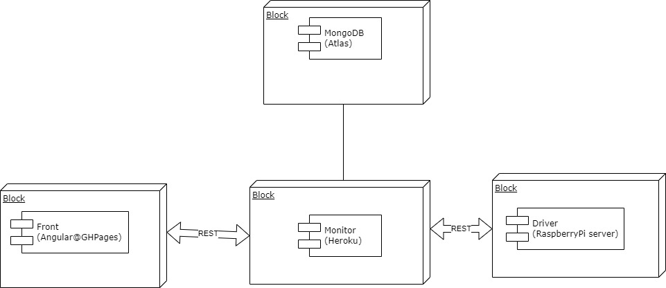

# rPiMS
# raspberryPi Monitoring System - monitor
Część projektu na raspberryPi. Monitor - odpowiada za połączenie z driverem na malince, odczytuje parametry, zarządza chłodzeniem, kontaktuje się z bazą danych (MongoDb na Atlasie) oraz udostępnia ednpointy dla frontendu.

Endpointy: 
/thermowelltmp - pokazuje dane z rpi, thermowell i temperatura pomieszczenia (obecnie placeholder). Kiedy malinka jest wyłączona lub brak połączenia pokazuje 99.0 
/carbonation/{temperature}&{desiredCarb} - przekazuje dane do kalkulatora, oblicza potrzebne ciśnienie do zadanego nagazowania

TODO: 
-refaktoring częsci odpowiadającej za zapis do mongo

Front do aplikacji będzie na: https://kchwistek-prog.github.io/

Schemat ogólny aplikacji:

